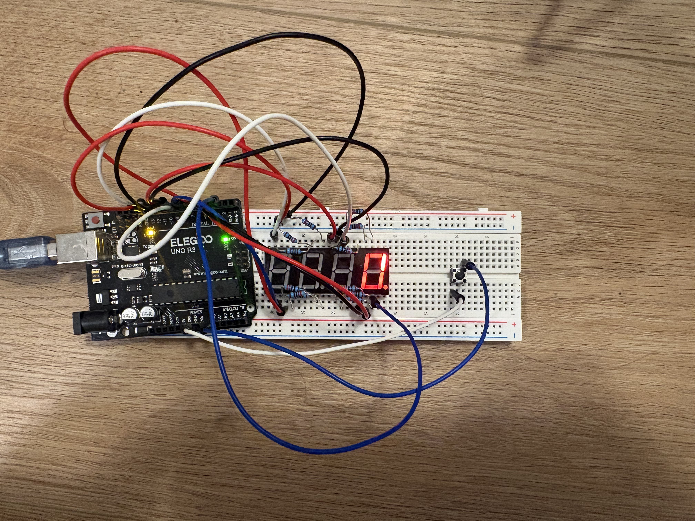
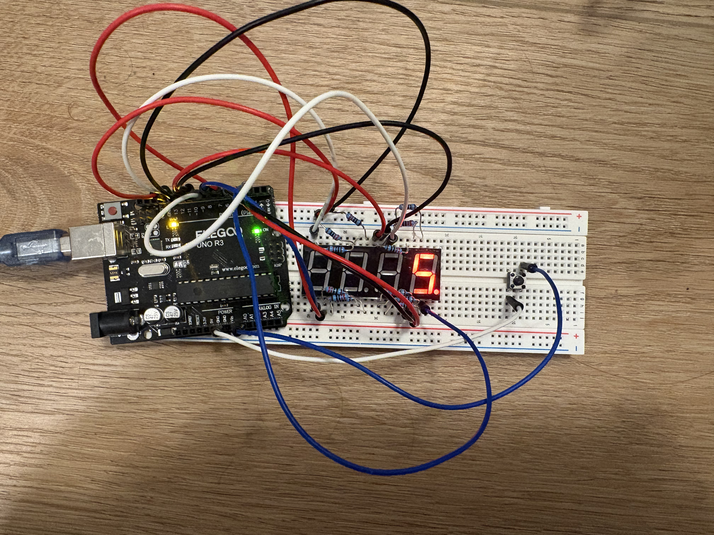

# Arduino 7-Segment Counter

A push-button-controlled counter built with an Arduino Uno, a breadboard, and a multiplexed 4-digit 7-segment display. This version uses the two rightmost display positions to show values from `00` to `99`. Press A0 to increase the value, then press A1 to count down automatically to `00`.

## Video demo

[Watch the Arduino 7-segment counter demo on YouTube](https://youtube.com/shorts/C67w0dFQiRg?feature=share)

## Hardware demo

## Features

- Counts upward from `00` through `99`
- Counts down automatically from the selected value to `00`
- Uses the two rightmost digits of the 4-digit display
- Uses a push button connected to A0 with `INPUT_PULLUP` to increase the value
- Uses a push button connected to A1 with `INPUT_PULLUP` to start the countdown
- Debounces button presses and refreshes the two display positions through multiplexing

## Hardware

- Arduino Uno
- 4-digit 7-segment display
- Breadboard and jumper wires
- Two push buttons
- Resistors

## Pin mapping

| Function | Arduino pin |
| --- | --- |
| Segment A | 13 |
| Segment B | 8 |
| Segment C | 4 |
| Segment D | 6 |
| Segment E | 7 |
| Segment F | 11 |
| Segment G | 3 |
| Ones digit / rightmost display | 5 |
| Tens digit / second display | 9 |
| Increase button | A0 |
| Countdown button | A1 |

## How it works

The two display positions share the segment wires. The sketch enables one position at a time, updates its segment pattern, then quickly switches to the other position. This multiplexing cycle repeats quickly enough for both digits to appear continuously lit.

Both buttons use the Arduino internal pull-up resistor, so a press reads as `LOW`. The A0 button increases the selected number once per press. The A1 button starts a half-second-per-number countdown to `00`.

## Run it

1. Open `count_upward.ino` in Arduino IDE.
2. Wire the circuit using the pin mapping above.
3. Select the Arduino board and serial port.
4. Upload the sketch.
5. Press A0 to set a number from `00` to `99`, then press A1 to start the countdown.
